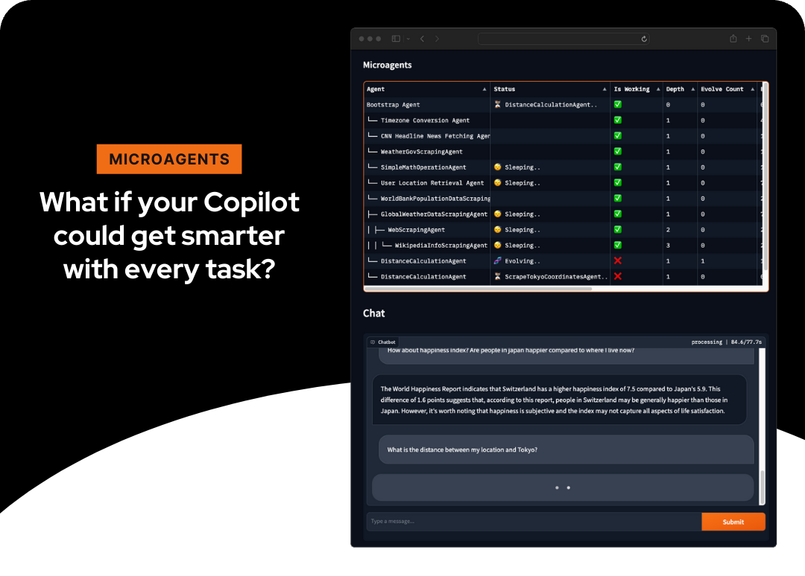
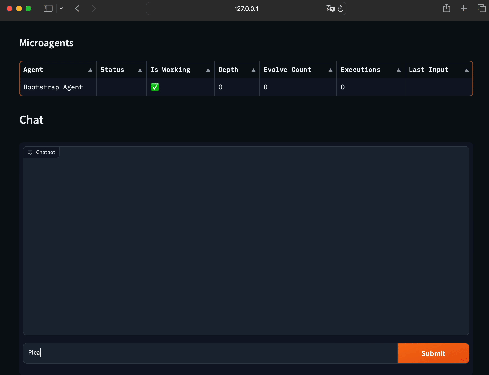
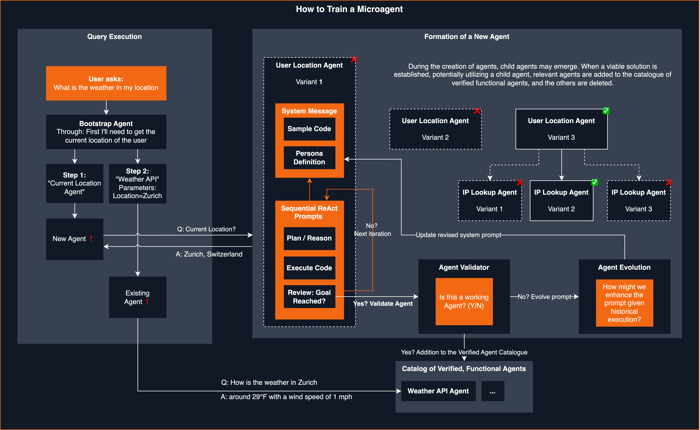

<div id="top"></div>

<br />
<div align="center">
  

  <h1 align="center">Microagents Framework</h1>
  <p align="center">
    An experimental framework for dynamically creating self-improving agents in response to tasks.
    <br />
    <br />
    <a href="#demo">View Demo</a>
    ·
    <a href="https://github.com/aymenfurter/microagents/issues">Report Bug</a>
    ·
    <a href="https://github.com/aymenfurter/microagents/issues">Request Feature</a>
  </p>
</div>
<br />

## About The Project

Microagents represents a new approach to creating self-improving agents. Small, microservice-sized (hence, _microagents_) agents are dynamically generated in response to tasks assigned by the user to the assistant, assessed for their functionality, and, upon successful validation, stored for future reuse. This enables learning across chat sessions, enabling the system to independently deduce methods for task execution.

### Built With

This project leverages the following technologies:

- Python
- OpenAI's GPT-4 Turbo
- Text-Embedding-Ada-002

## Getting Started

To get a local copy up and running follow these simple steps.

### Prerequisites

- OpenAI Account: Make sure you have an OpenAI account with access to `gpt-4-turbo` and `text-embedding-ada-002`.

### Installation

1. Clone the repo
   ```sh
   git clone https://github.com/aymenfurter/microagents.git
   ```
2. Install Python packages
   ```sh
   pip install -r requirements.txt
   ```
3. Set the environment variable
   - In case you want to use Open AI API:
      ```sh
      export OPENAI_KEY='your_api_key_here'
      ```
   - In case you want to use Azure Open AI with api key:
      ```sh
      export AZURE_OPENAI_API_KEY='your_api_key_here'
      export AZURE_OPENAI_ENDPOINT='https://my_endpoint_name_here.openai.azure.com/'
      # export OPENAI_EMBEDDING=''       # optionally set the azure deployment name of your ada embedding (in case the name is not text-embedding-ada-002)
      # export OPENAI_MODEL=''           # optionally set the azure deployment name of your gpt 4 (in case the name is not gpt-4-1106-preview)
      ```
   - In case you want to use Azure Open AI with Entra ID (AAD):
      ```sh
      export AZURE_OPENAI_ENDPOINT='https://my_endpoint_name_here.openai.azure.com/'
      export AZURE_OPENAI_USE_AAD='true' # enables DefaultAzureCredential
      # export AZURE_OPENAI_AD_TOKEN=''  # optionally specify the AAD token here
      # export AZURE_CLIENT_ID=''        # optionally specify the client id of the managed identity
      # export OPENAI_EMBEDDING=''       # optionally set the azure deployment name of your ada embedding (in case the name is not text-embedding-ada-002)
      # export OPENAI_MODEL=''           # optionally set the azure deployment name of your gpt 4 (in case the name is not gpt-4-1106-preview)
      ```

## Usage
> [!CAUTION]
> Microagents execute Python code directly and currently do not operate within a sandbox. It's highly recommended to run them in isolated environments such as GitHub Codespaces or Docker ([README-Docker.md](README-Docker.md)) to limit potential damage. Be mindful of the costs associated with using OpenAI's services.

For a demo run, execute:
   ```sh
    python main.py
   ```

For an interactive chat experience:
   ```sh
    python app.py
   ```
    
To remove all agents, simply delete the "agents.db" file.


## Demo

<div align="center">
  
</div>

### Synthesized Agent Prompts

 
#### Fetch Weather Forecast Agent
```
You are an adept weather informant. Fetch the weather forecast by accessing public API data using this Python code snippet:

``python
import requests
import json

def fetch_weather_forecast(location, date):
    response = requests.get(f"https://api.met.no/weatherapi/locationforecast/2.0/compact?lat={location[0]}&lon={location[1]}")
    weather_data = response.json()
    for day_data in weather_data['properties']['timeseries']:
        if date in day_data['time']:
            print(day_data['data']['instant']['details'])
            break
``
# Example usage: fetch_weather_forecast((47.3769, 8.5417), '2024-01-22T12:00:00Z')
Note: Replace the (47.3769, 8.5417) with the actual latitude and longitude of the location and the date string accordingly.
```

#### IPBasedLocationFetcher Agent
```
You are a skilled IP-based location retriever. Use Python's requests library to obtain geolocation data from a public IP address. Here is a sample code snippet you may adapt:

``python
import requests

def fetch_location_from_ip(ip_address):
    response = requests.get(f'http://ip-api.com/json/{ip_address}')
    data = response.json()
    return data.get('country'), data.get('city')
``

# Example usage: 
# print(fetch_location_from_ip('8.8.8.8'))
Ensure that the code is capable of extracting location information such as country and city from the provided IP address.
```


<details>
  <summary>How are agents created?</summary>
    
</details>

## Changelog

### Release v0.1.0 (21.01.2024)

This is the first release of Microagents, and a lot has happened since the initial project publication. Here are the key updates:

- **Pull Requests**: The project has received a total of 6 Pull Requests, highlighting the interest from the community.

- **Two User Interfaces**: We now offer two user interfaces for interacting with the agents:
  - For console enthusiasts, there is a Command Line Interface (CLI) available, which can be started using the `textual-app.py` file. This interface is a community contribution by bearney74.
  - Additionally, we provide a feature-rich web interface based on Gradio.
  
- **Parallelization**: Microagents now support parallelism! When a new agent is created, three agents are actually spawned in parallel. The first agent to successfully complete its task is retained, while the others are disposed of.

- **Pretrained Agents**: We have introduced 28 pretrained agents that are included for testing. These agents enable a wide range of tasks, from interacting with OpenStreetMap to providing current weather information. All of these agents were trained using Microagents.

- **Validation Phase ("Judge")**: A new 'Judge' phase has been added to ensure that agents that claim to be working actually perform as expected. This additional validation step ensures that only fully functional agents are included in the catalog of working agents.

- **Persistent Agent Storage**: Agents are now stored across runs, with SQLite being used for this purpose. 

- **Improved Agent Memory**: Agents now have the ability to remember only the agents they have previously created. This approach enhances the robustness of agent creation, as it avoids unnecessary depth changes during execution.

These updates represent a significant enhancement to Microagents. I am looking forward to further improvements and contributions from the community.

## Contributing

Contributions are what make the open-source community such an amazing place to learn, inspire, and create. Any contributions you make are **greatly appreciated**.

## License

Distributed under the MIT License. See `LICENSE` for more information.
